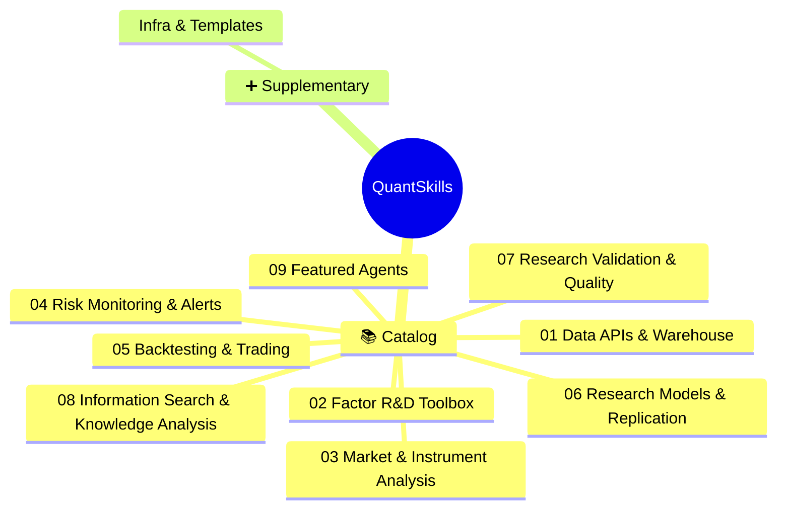

<!-- 本文件由 scripts/build.mjs 自动生成，请勿手工编辑。Generated file — do not edit by hand. -->
# 🧭 quantskills
> A panoramic, clickable navigator for the QuantSkills org — skills / factors / agents at a glance.

[简体中文](README.md) | **English**

   

**QUANTSKILLS** is an open community for **Quant Skills and Agents** in the AI Agent era. Initiated by [PandaAI](https://www.tqx.ai/), it helps quant developers turn trading experience, research methods, factor models, and strategy code into standardized assets that can be **searched, installed, validated, and shared**.

> Turn your quant experience into Skills that humans can trust and AI Agents can use.

## 🗺️ Overview

## 📑 Contents
- [01 Data APIs & Warehouse](#cat-01)
- [02 Factor R&D Toolbox](#cat-02)
- [03 Market & Instrument Analysis](#cat-03)
- [04 Risk Monitoring & Alerts](#cat-04)
- [05 Backtesting & Trading](#cat-05)
- [06 Research Models & Replication](#cat-06)
- [07 Research Validation & Quality](#cat-07)
- [08 Information Search & Knowledge Analysis](#cat-08)
- [09 Featured Agents](#cat-09)
- [🧱 Infra & Templates](#infra)

## 01 Data APIs & Warehouse

| Project | Description | Screenshot |
|---|---|---|
| [skill-pandadata-warehouse](https://github.com/quantskills/skill-pandadata-warehouse) | Manages local Pandadata DuckDB and Parquet quantitative data warehouses, caches, and queries. |  |
| [skill-pandadata-api](https://github.com/quantskills/skill-pandadata-api) | Provides Pandadata market and research API calls and contract lookup across agent runtimes. | — |
| [skill-us-sec-edgar-harvester](https://github.com/quantskills/skill-us-sec-edgar-harvester) | Harvests and structures public US SEC EDGAR filings. | — |

## 02 Factor R&D Toolbox

| Project | Description | Screenshot |
|---|---|---|
| [skill-factormad-debate-factor-mining](https://github.com/quantskills/skill-factormad-debate-factor-mining) | Uses a FactorMAD-style multi-agent debate framework for interpretable stock-alpha mining. |  |
| [skill-factor-grouped-wrapper](https://github.com/quantskills/skill-factor-grouped-wrapper) | Wraps grouped factor-processing workflows and their pipeline diagrams. | — |
| [skill-pandaai-factor-online](https://github.com/quantskills/skill-pandaai-factor-online) | Supports PandaAI factor onboarding, online mining, batch backtests, and cost review. | — |
| [skill-factor-mason](https://github.com/quantskills/skill-factor-mason) | Checks timing, IC/IR, costs, and neutralization quality in single-factor research. | — |
| [skill-ml-factor-ensemble](https://github.com/quantskills/skill-ml-factor-ensemble) | Ensembles machine-learning models into factor meta-signals with leakage-aware rolling validation. | — |
| [skill-factor-mining-pandaai](https://github.com/quantskills/skill-factor-mining-pandaai) | Mines factors with PandaAI data and feedback or extracts them from public documents. | — |
| [skill-factor-backtest](https://github.com/quantskills/skill-factor-backtest) | Runs long-only cross-sectional factor backtests on supplied factors and market data with diagnostics. | — |
| [skill-residual-guided-factor-selection](https://github.com/quantskills/skill-residual-guided-factor-selection) | Selects factor combinations using residual IC and out-of-sample evaluation. | — |
| [skill-factor-ranking-sage](https://github.com/quantskills/skill-factor-ranking-sage) | Runs mRMR or Marginal-SAGE on local factor and label data to produce Top-K rankings. | — |
| [skill-factor-idea-generation](https://github.com/quantskills/skill-factor-idea-generation) | Generates candidate factor ideas with economic rationale and risk notes from the default data scope. | — |
| [skill-alpha-ncav-graham](https://github.com/quantskills/skill-alpha-ncav-graham) | Computes a Graham NCAV discount factor for A-share deep-value screening and buy-sell-hold signals. | — |
| [skill-quant-factor-volume-stat-alpha](https://github.com/quantskills/skill-quant-factor-volume-stat-alpha) | Provides an OHLCV factor library for volume and price-volume statistical research. |  |
| [skill-quant-factor-skill-factory](https://github.com/quantskills/skill-quant-factor-skill-factory) | Batch-generates, validates, and packages framework-neutral OHLCV factor skills. |  |
| [skill-quant-factor-risk-pattern-alpha](https://github.com/quantskills/skill-quant-factor-risk-pattern-alpha) | Provides an OHLCV factor library for volatility, chart-pattern, and drawdown-pressure research. |  |
| [skill-quant-factor-directional-alpha](https://github.com/quantskills/skill-quant-factor-directional-alpha) | Provides an OHLCV directional-factor library for trend, breakout, and reversal research. |  |
| [skill-overseas-equity-factor-miner](https://github.com/quantskills/skill-overseas-equity-factor-miner) | Discovers and validates HK and US cross-sectional alpha factors by IC, decay, and turnover. | — |
| [skill-ic-analysis](https://github.com/quantskills/skill-ic-analysis) | Evaluates quantitative factors through IC, grouped performance, and predictive effectiveness. |  |
| [skill-fundamental-factor-analysis](https://github.com/quantskills/skill-fundamental-factor-analysis) | Computes and validates A-share valuation, quality, and growth factors from quarterly financial reports. | — |
| [skill-factor-review](https://github.com/quantskills/skill-factor-review) | Scans a factor library and experiment logs for inventory, structural analysis, and research recommendations. |  |
| [skill-factor-pool-evolution](https://github.com/quantskills/skill-factor-pool-evolution) | Generates mutation, crossover, and recommendations from evaluated seed factor pools. | — |
| [skill-factor-orthogonalize](https://github.com/quantskills/skill-factor-orthogonalize) | Orthogonalizes cross-sectional factors with daily OLS and outputs residual factors and exposure diagnostics. | — |
| [skill-factor-optimize](https://github.com/quantskills/skill-factor-optimize) | Runs parameter sweeps, ablations, and version refinements for existing equity or futures factors. | — |
| [skill-factor-mine](https://github.com/quantskills/skill-factor-mine) | Provides a factor-mining SOP from hypothesis and experiment notes through scoring and accept/rollback. |  |
| [skill-factor-evaluate](https://github.com/quantskills/skill-factor-evaluate) | Scores a cross-sectional factor using IC, Sharpe, drawdown, monotonicity, and turnover. |  |
| [skill-factor-decay](https://github.com/quantskills/skill-factor-decay) | Analyzes decay in Rank IC, turnover, and bucket returns and estimates half-life. | — |
| [skill-factor-debug](https://github.com/quantskills/skill-factor-debug) | Provides a symptom, cause, and verification playbook for factor failures. |  |
| [skill-factor-blend](https://github.com/quantskills/skill-factor-blend) | De-redundantly weights and combines multiple factor signals into a composite signal. | — |
| [skill-factor-alpha191-alpha101](https://github.com/quantskills/skill-factor-alpha191-alpha101) | Computes Alpha101 and Alpha191 factors from long-form OHLCV CSV and outputs wide CSV. | — |
| [skill-doc-to-alphas](https://github.com/quantskills/skill-doc-to-alphas) | Defines OHLCV alpha-expression formats and validation rules for document-derived factors. |  |
| [skill-alpha-a06-hotmoney-reversal](https://github.com/quantskills/skill-alpha-a06-hotmoney-reversal) | Computes a hot-money seat cooling and reversal factor from Dragon-Tiger and market data with validation artifacts. | — |
| [skill-alpha-f1-position-change](https://github.com/quantskills/skill-alpha-f1-position-change) | Computes a futures top-20-seat position-change factor and signal from net-position data. | — |
| [skill-alpha-f5-member-position-concentration](https://github.com/quantskills/skill-alpha-f5-member-position-concentration) | Computes member-position concentration signals from institutional, hot-money, and northbound net positions. | — |
| [skill-alpha-f6-family-position-reverse](https://github.com/quantskills/skill-alpha-f6-family-position-reverse) | Computes a futures family-position reversal signal from seat-position relationships. | — |
| [skill-alpha-f8-family-main-divergence](https://github.com/quantskills/skill-alpha-f8-family-main-divergence) | Computes a futures family-versus-main-seat position-divergence factor signal. | — |
| [skill-build-b10-factor-evaluation](https://github.com/quantskills/skill-build-b10-factor-evaluation) | Evaluates quantitative factors with IC, IR, stratified backtests, monotonicity, turnover, and decay diagnostics. | — |

## 03 Market & Instrument Analysis

| Project | Description | Screenshot |
|---|---|---|
| [skill-dl-gnn-stock-graph](https://github.com/quantskills/skill-dl-gnn-stock-graph) | Builds A-share heterogeneous graphs for GNN stock selection and backtesting. | — |
| [skill-audit-opinion-scanner](https://github.com/quantskills/skill-audit-opinion-scanner) | Assesses A-share financial health from audit opinions, statements, and industry benchmarks with risk checks. | — |
| [skill-stock-memory-analyzer-usa](https://github.com/quantskills/skill-stock-memory-analyzer-usa) | Performs multidimensional research analysis of US memory-chip stocks. | — |
| [skill-portfolio-liquidity-stress-test](https://github.com/quantskills/skill-portfolio-liquidity-stress-test) | Estimates portfolio liquidation days, horizon cash, redemption shortfalls, and impact costs under volume stress. | — |
| [skill-index-rebalance-event-study](https://github.com/quantskills/skill-index-rebalance-event-study) | Runs reproducible event studies for index additions, deletions, and weight changes. | — |
| [skill-oil-brief](https://github.com/quantskills/skill-oil-brief) | Combines futures, EIA, OPEC, and market data into Chinese crude-oil briefs. | — |
| [skill-us-sector-rotation](https://github.com/quantskills/skill-us-sector-rotation) | Generates factual reports on US sector performance, valuation, and rotation. | — |
| [skill-hk-us-dividend-events](https://github.com/quantskills/skill-hk-us-dividend-events) | Generates HK and US equity dividend-event reports using Pandadata overseas-market interfaces. | — |
| [skill-cross-listing-parity](https://github.com/quantskills/skill-cross-listing-parity) | Monitors A/H and China ADR cross-listing parity using prices, FX, and share ratios. | — |
| [skill-hk-us-quote-scan](https://github.com/quantskills/skill-hk-us-quote-scan) | Builds HK and US equity snapshots covering quotes, liquidity, valuation, and industry-relative position. | — |
| [skill-hk-us-consensus-radar](https://github.com/quantskills/skill-hk-us-consensus-radar) | Summarizes HK/US sell-side ratings, target prices, growth expectations, and changes. | — |
| [skill-dividend-yield-scan](https://github.com/quantskills/skill-dividend-yield-scan) | Calculates A-share rolling dividend yield, dividend continuity, and ex-dividend calendars. | — |
| [skill-stock-screener](https://github.com/quantskills/skill-stock-screener) | Screens A-share stocks from natural-language criteria and Pandadata evidence. |  |
| [skill-smart-money-profiler](https://github.com/quantskills/skill-smart-money-profiler) | Analyzes LHB seats, northbound activity, and capital-flow consensus or divergence. | — |
| [skill-portfolio-checkup](https://github.com/quantskills/skill-portfolio-checkup) | Aggregates concentration, benchmark deviation, valuation, quality, and risk exposures into a portfolio health report. | — |
| [skill-options-vol-analyst](https://github.com/quantskills/skill-options-vol-analyst) | Analyzes option chains, implied and historical volatility, term structure, skew, and volatility premium. |  |
| [skill-market-daily-review](https://github.com/quantskills/skill-market-daily-review) | Generates Pandadata-based A-share after-close daily market review reports. |  |
| [skill-macro-monitor](https://github.com/quantskills/skill-macro-monitor) | Monitors macro data, industry conditions, economic calendars, and recurring macro changes. | — |
| [skill-index-valuation-rotation](https://github.com/quantskills/skill-index-valuation-rotation) | Analyzes A-share index valuation percentiles, relative industry valuation, and rotation signals. |  |
| [skill-global-macro-rates-fx-lab](https://github.com/quantskills/skill-global-macro-rates-fx-lab) | Produces sourced global macro briefs from public rates, central-bank, and FX data. | — |
| [skill-global-commodity-term-structure](https://github.com/quantskills/skill-global-commodity-term-structure) | Uses public data to study global commodity-futures term structure, roll yield, and spreads. | — |
| [skill-gao-shanwen-research-model](https://github.com/quantskills/skill-gao-shanwen-research-model) | Organizes, retrieves, and studies Gao Shanwen's public writings and articles. | — |
| [skill-futures-deepview-analyst](https://github.com/quantskills/skill-futures-deepview-analyst) | Turns futures DeepView natural-language requests into data-call plans and fact/inference-separated reports. | — |
| [skill-a1-lhb-tracking](https://github.com/quantskills/skill-a1-lhb-tracking) | Generates an event-ranking factor from Dragon-Tiger seat history, win rate, payoff, and next-session premium. | — |
| [skill-a-share-stock-dossier](https://github.com/quantskills/skill-a-share-stock-dossier) | Uses Pandadata to produce a sourced A-share dossier covering fundamentals, corporate actions, holders, event risks, and market funds. |  |
| [skill-hk-stock-dossier](https://github.com/quantskills/skill-hk-stock-dossier) | Generates nine-dimension Hong Kong equity due-diligence reports from Pandadata interfaces. | — |
| [skill-b7-lhb-monitor](https://github.com/quantskills/skill-b7-lhb-monitor) | Monitors Dragon-Tiger entries and seat labels to produce next-session watchlists and searchable views. | — |
| [skill-b6-limitup-pool](https://github.com/quantskills/skill-b6-limitup-pool) | Maintains a daily limit-up pool with board, break, reseal, theme, sentiment, and dashboard outputs. | — |
| [skill-xingtai-catcher](https://github.com/quantskills/skill-xingtai-catcher) | Retrieves similar A-share and futures K-line patterns from text or image descriptions. | — |

## 04 Risk Monitoring & Alerts

| Project | Description | Screenshot |
|---|---|---|
| [skill-holder-structure-scan](https://github.com/quantskills/skill-holder-structure-scan) | Tracks A-share holder counts, top-holder concentration, and free float to assess ownership concentration. | — |
| [skill-concept-rotation-monitor](https://github.com/quantskills/skill-concept-rotation-monitor) | Monitors A-share concept and theme momentum, breadth, and rotation for research reports. | — |
| [skill-refinancing-monitor](https://github.com/quantskills/skill-refinancing-monitor) | Tracks A-share refinancing lifecycles, pricing, and dilution risk. | — |
| [skill-institutional-research-tracker](https://github.com/quantskills/skill-institutional-research-tracker) | Monitors A-share institutional research activity, attention, and changes over time. | — |
| [skill-buyback-monitor](https://github.com/quantskills/skill-buyback-monitor) | Monitors A-share buyback lifecycles, purposes, price ranges, and intensity for research. | — |
| [skill-macro-altdata-nowcast](https://github.com/quantskills/skill-macro-altdata-nowcast) | Uses high-frequency alternative macro data for industry nowcasts and trend monitoring. | — |
| [skill-hk-us-insider-radar](https://github.com/quantskills/skill-hk-us-insider-radar) | Scans HK and US insider transactions, net direction, trading clusters, and holding changes. | — |
| [skill-event-risk-alert](https://github.com/quantskills/skill-event-risk-alert) | Scans watchlists or holdings for unlock, pledge, ownership-change, and earnings-event risks. |  |
| [skill-earnings-season-tracker](https://github.com/quantskills/skill-earnings-season-tracker) | Scans earnings guidance, industry distributions, and qualified audit items during earnings seasons. | — |
| [skill-block-trade-radar](https://github.com/quantskills/skill-block-trade-radar) | Builds an A-share block-trade radar from discount or premium, volume, and price evidence. | — |

## 05 Backtesting & Trading

| Project | Description | Screenshot |
|---|---|---|
| [skill-backtest](https://github.com/quantskills/skill-backtest) | Provides a cross-sectional long-only backtest protocol with T+1 execution, fees, limit filters, and diagnostics. |  |
| [skill-portfolio-optimize](https://github.com/quantskills/skill-portfolio-optimize) | Turns alpha signals into optimized weights under weight, sector, exposure, and turnover constraints. | — |
| [skill-dalio-all-weather](https://github.com/quantskills/skill-dalio-all-weather) | Provides an all-weather allocation and backtest workflow for A-share assets, bonds, gold, and commodities. | — |
| [skill-simons-pairs-trading](https://github.com/quantskills/skill-simons-pairs-trading) | Studies A-share pairs trading with cointegration, spreads, and execution constraints. | — |
| [skill-survivorship-universe-auditor](https://github.com/quantskills/skill-survivorship-universe-auditor) | Audits point-in-time universe membership, identities, and delisting returns before backtests. | — |
| [skill-intraday-data-quality-auditor](https://github.com/quantskills/skill-intraday-data-quality-auditor) | Audits normalized intraday OHLCV data for timestamp, gap, price, volume, and trading-date defects. | — |
| [skill-futures-roll-auditor](https://github.com/quantskills/skill-futures-roll-auditor) | Audits continuous-contract selection, roll gaps, and adjustment factors and produces a roll ledger. | — |
| [skill-corporate-action-adjustment-auditor](https://github.com/quantskills/skill-corporate-action-adjustment-auditor) | Audits split and cash-dividend consistency between raw and adjusted equity prices before research. | — |
| [skill-model-hpo-evidence-driven](https://github.com/quantskills/skill-model-hpo-evidence-driven) | Optimizes quantitative multi-factor model hyperparameters with fixed validation and trial-level evidence. | — |
| [skill-x-trader-builder](https://github.com/quantskills/skill-x-trader-builder) | Builds trader-specific research-model skills from public X/Twitter post data. |  |
| [skill-ssquant-trader-generator](https://github.com/quantskills/skill-ssquant-trader-generator) | Turns natural-language trading ideas into a reusable Trader Skill and delegates simulated deployment. | — |
| [skill-ssquant-ai-trader](https://github.com/quantskills/skill-ssquant-ai-trader) | Orchestrates SSQuant strategy research, paper trading, and runtime checks. |  |
| [skill-risk-model](https://github.com/quantskills/skill-risk-model) | Builds a multifactor risk model and performs risk attribution. | — |
| [skill-pandaai-workflow-generator](https://github.com/quantskills/skill-pandaai-workflow-generator) | Generates importable PandaAI workflow JSON and embedded strategy or factor code from quant ideas. | — |
| [skill-pandaai-workflow-audit](https://github.com/quantskills/skill-pandaai-workflow-audit) | Audits PandaAI workflow graphs, code, timing, parameters, and backtest-validation evidence. | — |
| [skill-market-regime-analysis](https://github.com/quantskills/skill-market-regime-analysis) | Classifies A-share market regimes using index, macro, futures term-structure, and volatility features. | — |
| [skill-jq-to-panda-converter](https://github.com/quantskills/skill-jq-to-panda-converter) | Converts JoinQuant strategy code into PandaAI JSON configurations runnable in backtests. | — |
| [skill-global-macro-trend-strategy](https://github.com/quantskills/skill-global-macro-trend-strategy) | Turns global signals and public daily prices into backtestable research strategies, positions, and risk rules. | — |
| [skill-backtest-overfit](https://github.com/quantskills/skill-backtest-overfit) | Evaluates backtest overfitting and multiple-testing risk with DSR, PBO, purged cross-validation, and Harvey-Liu haircut. | — |
| [skill-qbti](https://github.com/quantskills/skill-qbti) | Translates a five-part user questionnaire into factor directions and strategy parameters. | — |
| [skill-b12-intraday-position-manager](https://github.com/quantskills/skill-b12-intraday-position-manager) | Manages intraday multi-instrument positions using sellable and locked quantity, price, and cash inputs. | — |
| [skill-b11-auto-stop-loss-take-profit](https://github.com/quantskills/skill-b11-auto-stop-loss-take-profit) | Applies entry-date and open-price rules for take-profit, stop-loss, forced exits, and single-name position caps. | — |

## 06 Research Models & Replication

| Project | Description | Screenshot |
|---|---|---|
| [skill-hk-us-consensus-revision-radar](https://github.com/quantskills/skill-hk-us-consensus-revision-radar) | Organizes cross-period HK/US target-price and rating revisions into a research report. | — |
| [skill-time-series-analysis](https://github.com/quantskills/skill-time-series-analysis) | Diagnoses financial time series and produces analysis reports. |  |
| [skill-serenity-research-model](https://github.com/quantskills/skill-serenity-research-model) | Reconstructs Serenity-style research logic from public X/Twitter evidence. |  |
| [skill-report-replication](https://github.com/quantskills/skill-report-replication) | Guides conversion of research reports into reproducible analysis workflows. |  |
| [skill-quant-research-replication](https://github.com/quantskills/skill-quant-research-replication) | Guides auditable quantitative-research replication workflows. |  |
| [skill-paper-replication](https://github.com/quantskills/skill-paper-replication) | Supports paper search, data extraction, experiment reproduction, and research-result reporting. |  |
| [skill-gaetano-crux-capital-research-model](https://github.com/quantskills/skill-gaetano-crux-capital-research-model) | Uses public sources to structure research evidence and risks for photonics, optical-network, and AI-infrastructure companies. |  |
| [skill-investment-decision](https://github.com/quantskills/skill-investment-decision) | Combines research evidence, valuation, and risk information into an auditable investment decision report. | — |

## 07 Research Validation & Quality

| Project | Description | Screenshot |
|---|---|---|
| [skill-signal-portfolio-optimize](https://github.com/quantskills/skill-signal-portfolio-optimize) | 将单因子或模型生成的股票信号，转换为兼顾收益、风险、换手与交易约束的组合权重，并完成统一回测和风险归因。 | — |
| [skill-minuteflow-alpha](https://github.com/quantskills/skill-minuteflow-alpha) | — | — |
| [skill-klarman-special-situations](https://github.com/quantskills/skill-klarman-special-situations) | Researches private placements, restructurings, spin-offs, and distressed turnarounds as special situations. | — |
| [skill-buffett-moat-screener](https://github.com/quantskills/skill-buffett-moat-screener) | Screens A-share and US companies using moat, valuation, and point-in-time data for research records. | — |
| [skill-quant-research-experiment-registry](https://github.com/quantskills/skill-quant-research-experiment-registry) | Registers quantitative experiments and audits their reproducibility evidence. | — |
| [skill-rolling-beta-exposure](https://github.com/quantskills/skill-rolling-beta-exposure) | Estimates rolling beta exposure of assets or portfolios relative to a benchmark. | — |
| [skill-signal-stability-audit](https://github.com/quantskills/skill-signal-stability-audit) | Audits quantitative-signal stability across time and samples. | — |
| [skill-calendar-anomaly-scanner](https://github.com/quantskills/skill-calendar-anomaly-scanner) | Scans dated price changes for calendar anomalies using robust tests, bootstrap checks, and multiple-testing control. | — |
| [skill-brinson-performance-attribution](https://github.com/quantskills/skill-brinson-performance-attribution) | Runs Brinson-Fachler or BHB attribution with HHI, contributor ranking, and Carino multi-period linking. | — |
| [skill-walk-forward-validator](https://github.com/quantskills/skill-walk-forward-validator) | Validates cross-sectional signals out of sample with purged and embargoed rolling windows. | — |
| [skill-quant-execution-microstructure](https://github.com/quantskills/skill-quant-execution-microstructure) | Converts approved trade targets into observable, cost-aware execution plans. | — |
| [skill-daily-report](https://github.com/quantskills/skill-daily-report) | Aggregates cross-market prices, sectors, flows, and news into a daily Markdown review. | — |
| [skill-quant-portfolio-risk](https://github.com/quantskills/skill-quant-portfolio-risk) | Analyzes portfolio risk exposures, constraints, and stress scenarios. | — |
| [skill-quant-research](https://github.com/quantskills/skill-quant-research) | Guides quantitative research, backtest design, and statistical validation workflows. | — |
| [skill-risk-return-metrics](https://github.com/quantskills/skill-risk-return-metrics) | Calculates risk-return metrics for portfolios or strategies. | — |
| [skill-pair-correlation](https://github.com/quantskills/skill-pair-correlation) | Computes and interprets asset-pair correlations, rolling relationships, and research uses. | — |
| [skill-ma-crossover-signal](https://github.com/quantskills/skill-ma-crossover-signal) | Computes moving-average crossover signals and reports trend state, latest cross, MA gap, and price bias. | — |
| [skill-a-share-market-risk-radar](https://github.com/quantskills/skill-a-share-market-risk-radar) | Scans A-share macro, funding, valuation, trend, sector-rotation, and event evidence into risk levels. | — |
| [skill-oversold-rebound](https://github.com/quantskills/skill-oversold-rebound) | Identifies A-share oversold-rebound conditions and screens candidate stocks. | — |
| [skill-etf-fund-evaluator](https://github.com/quantskills/skill-etf-fund-evaluator) | Evaluates domestic non-QDII passive equity-index ETFs and comparable-index peers. | — |
| [skill-cb-analyzer](https://github.com/quantskills/skill-cb-analyzer) | Analyzes A-share convertible bonds with double-low screening, terms, equity linkage, Greeks, and volatility. | — |
| [skill-northbound-margin-monitor](https://github.com/quantskills/skill-northbound-margin-monitor) | Monitors northbound flows, margin trading, and futures conditions with multiple risk signals. | — |
| [skill-post-market-screener](https://github.com/quantskills/skill-post-market-screener) | Screens A-share stocks after market close using technical patterns and capital-flow evidence. | — |
| [skill-keynes-contrarian-investment](https://github.com/quantskills/skill-keynes-contrarian-investment) | Uses long-term expectations and contrarian analysis to identify optimism, pessimism, and value traps. | — |
| [skill-forecast-calibration-audit](https://github.com/quantskills/skill-forecast-calibration-audit) | Audits probability-forecast calibration rather than sample ranking alone. | — |
| [skill-portfolio-pnl-attribution](https://github.com/quantskills/skill-portfolio-pnl-attribution) | Attributes realized portfolio returns by security and sector while reconciling fees, benchmarks, and input quality. | — |
| [skill-transaction-cost-calibration](https://github.com/quantskills/skill-transaction-cost-calibration) | Calibrates commission, spread, slippage, and market-impact assumptions from execution and market data. | — |
| [skill-statistical-arbitrage-time-series](https://github.com/quantskills/skill-statistical-arbitrage-time-series) | Builds statistical-arbitrage time-series research and produces traceable reports. | — |
| [skill-backtesting-bias-avoidance](https://github.com/quantskills/skill-backtesting-bias-avoidance) | Builds look-ahead-safe backtests and audits leakage, survivorship, overfitting, costs, and out-of-sample checks. | — |
| [skill-ag-futures-seasonality](https://github.com/quantskills/skill-ag-futures-seasonality) | Computes monthly agricultural-futures seasonality from daily prices and overlays crop-calendar context. | — |
| [skill-portfolio-attribution](https://github.com/quantskills/skill-portfolio-attribution) | Attributes active portfolio returns to industry allocation, stock selection, interaction, and factor contributions. | — |
| [skill-capital-flow-crowding-monitor](https://github.com/quantskills/skill-capital-flow-crowding-monitor) | Aggregates margin, northbound-holding, and block-trade data into consensus, divergence, and crowding-percentile signals. | — |
| [skill-etf-arbitrage-monitor](https://github.com/quantskills/skill-etf-arbitrage-monitor) | Monitors A-share ETF primary/secondary-market premiums and redemption-basket feasibility. | — |
| [skill-commodity-carry-cta](https://github.com/quantskills/skill-commodity-carry-cta) | Builds commodity-futures carry, time-series momentum, cross-sectional momentum, basis, and inventory factors for rotation backtests. | — |
| [skill-option-strategy-builder](https://github.com/quantskills/skill-option-strategy-builder) | Builds option strategies with legs, payoff charts, breakevens, Greeks, and margin analysis. | — |
| [skill-transaction-cost-analysis](https://github.com/quantskills/skill-transaction-cost-analysis) | Decomposes fills against VWAP/TWAP into transaction-cost components. | — |
| [skill-regulatory-risk-radar](https://github.com/quantskills/skill-regulatory-risk-radar) | Aggregates and grades A-share regulatory and compliance risk events. | — |
| [skill-strategy-tearsheet-report](https://github.com/quantskills/skill-strategy-tearsheet-report) | Generates strategy-performance tearsheets with risk-adjusted metrics. | — |
| [skill-a-share-pit-fundamental-vintage-builder](https://github.com/quantskills/skill-a-share-pit-fundamental-vintage-builder) | Builds and audits point-in-time A-share financial data without later restatements. | — |
| [skill-numerical-leak-check](https://github.com/quantskills/skill-numerical-leak-check) | Detects lookahead and data leakage in quantitative research workflows through numerical checks. | — |

## 08 Information Search & Knowledge Analysis

| Project | Description | Screenshot |
|---|---|---|
| [skill-munger-mental-model](https://github.com/quantskills/skill-munger-mental-model) | Applies a multidisciplinary mental-model framework to company investment research and judgment reports. | — |
| [skill-fin-news](https://github.com/quantskills/skill-fin-news) | Aggregates financial headlines and market data to select headlines and draft analysis articles. | — |
| [skill-news-sentiment-analyst](https://github.com/quantskills/skill-news-sentiment-analyst) | Collects, verifies, and analyzes A-share financial-news sentiment for research reports. | — |

## 09 Featured Agents

| Project | Description | Screenshot |
|---|---|---|
| [agent-future-trading](https://github.com/quantskills/agent-future-trading) | 基于多智能体协作的期货交易策略生成、历史回测与研究学习系统。 | — |
| [agent-quantspace](https://github.com/quantskills/agent-quantspace) | AI-native quantitative research framework for reusable skills, strategy workflows, backtests, and reports. |  |
| [agent-macro-driven-rotation](https://github.com/quantskills/agent-macro-driven-rotation) | Generates macro-driven industry-rotation research materials from clock phases, nowcasts, and valuation filters. | — |
| [agent-for-liangshuyuan-tasks](https://github.com/quantskills/agent-for-liangshuyuan-tasks) | Multi-agent collaboration framework for Liangshuyuan tasks, organizing quantitative tools, build workflows, and task roles. | — |
| [agent-ssquant](https://github.com/quantskills/agent-ssquant) | SSQuant Agent workflow for futures strategies, data services, CTP gates, and Chinese backtest reports. | — |
| [agent-market-regime-monitor](https://github.com/quantskills/agent-market-regime-monitor) | Monitors market regimes from Pandadata index breadth, volatility, and funding evidence. |  |
| [agent-derivatives-skew-sentiment-monitor](https://github.com/quantskills/agent-derivatives-skew-sentiment-monitor) | Monitors derivatives sentiment from option implied volatility and underlying historical volatility. |  |
| [agent-crowding-risk-monitor](https://github.com/quantskills/agent-crowding-risk-monitor) | Monitors crowded-trade risk from Pandadata price, turnover, margin, and Dragon-Tiger heat evidence. |  |
| [agent-correlation-break-research](https://github.com/quantskills/agent-correlation-break-research) | Uses Pandadata price-series correlation changes to identify style shifts, diversification stress, and structural market moves. |  |

---

## 🧱 Infra & Templates
Governance, scaffolding and templates (incl. the quantskills nav repo).

| Project | Description | Screenshot |
|---|---|---|
| [registry](https://github.com/quantskills/registry) | Public display registry for QUANTSKILLS skill-* and agent-* assets. | — |
| [quantskills](https://github.com/quantskills/quantskills) | QuantSkills组织的全景导航 ——Panoramic navigator for the QuantSkills organization | — |
| [agent-template](https://github.com/quantskills/agent-template) | Canonical template for portable QuantSkills agent projects. | — |
| [skill-template](https://github.com/quantskills/skill-template) | Provides a template structure and instructions for QuantSkills skill projects. | — |
| [.github](https://github.com/quantskills/.github) | — | — |
| [join](https://github.com/quantskills/join) | — | — |

---
## 🐼 PandaAI Community

  
   
  Scan to join the PandaAI community for QUANTSKILLS skills, agent workflows, and quant research.

